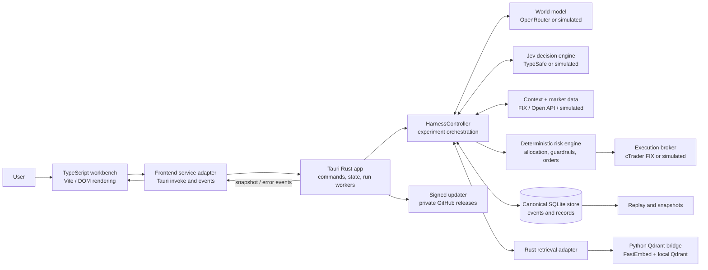
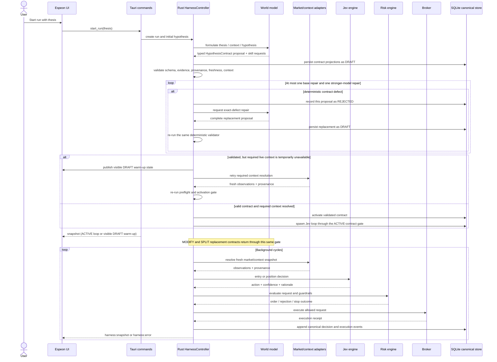

# Espeon Architecture

This document maps the Espeon application as it exists in this repository. It separates the implemented desktop workbench and Rust runtime from the earlier, broader trading-harness specification retained in the design documents.

## At a glance

Espeon is a Windows desktop application built with Tauri 2. Its TypeScript/Vite frontend presents and controls experiments. A Rust process is the runtime authority: it owns experiment lifecycle, model and broker adapters, deterministic risk decisions, market data, persistence, replay, and retrieval orchestration. Python is used as a local subprocess for Qdrant-based semantic retrieval. The frontend does not make trading decisions or store canonical experiment state.

## Repository map

| Path | Responsibility |
| --- | --- |
| `src/` | TypeScript UI, view state, display types, window chrome, chart rendering, and the frontend-to-Tauri service adapter. |
| `src-tauri/src/` | Rust desktop entry point, Tauri commands, harness orchestration, domain records, ports, adapters, risk, market data, storage, retrieval, replay, settings, and updates. |
| `src-tauri/tauri.conf.json` | Production Tauri configuration, frontend build command, NSIS installer, and updater configuration. |
| `src-tauri/tauri.dev.conf.json` | Development-specific Tauri configuration. |
| `config/harness.json` | Checked-in non-secret adapter, risk, runtime, and review defaults. |
| `.env` / connector settings | Local credentials and integration settings; `.env` is ignored by Git. |
| `runtime-harness/` | Local runtime data such as SQLite, Qdrant files, and cached retrieval models; ignored by Git. |
| `retrieval/qdrant_local_bridge.py` | Python subprocess protocol for local embeddings and Qdrant operations. |
| `tests/`, `src-tauri/tests/` | Python research checks and Rust integration coverage for the harness. |
| `.github/workflows/release.yml` | Windows release build, signing, and private GitHub release publication. |
| `runtime-btc/`, `research.py`, `actuals.py`, root docs | Adjacent/earlier research and trading materials; they are not the main Espeon desktop runtime path. |

## Runtime layers

### 1. Desktop shell and UI

`src-tauri/src/main.rs` enters the library's `run()` function. Tauri creates the Windows desktop window, loads the built `dist/` frontend, registers the updater plugin, and exposes Rust commands.

The UI is TypeScript rendered into the `#app` element in `src/main.ts`. Its state is presentation state: selected run and loop, current tab, search results, notices, open panels, and a few local layout preferences. It renders workspace snapshots, events, positions, evidence, history, and inspector details received from Rust. `src/types.ts` mirrors the serialized Rust-facing shapes.

`src/services/harness.ts` centralizes Tauri `invoke` calls and event subscriptions. In a regular browser preview, hydration returns an empty/degraded placeholder; operations that require canonical runtime state are restricted to the desktop app. The UI is therefore a client of the harness, not an independent trading runtime.

### 2. Tauri application boundary

`src-tauri/src/lib.rs` owns application initialization and command registration. It builds `AppState`, loads configuration and local services, restores active runs, and starts background workers. The registered commands cover starting/stopping runs, workspace hydration, snapshots, replay, search/retrieval/context ingestion, review, connector settings, and update checks.

Blocking harness and I/O operations are generally moved to Tauri's blocking worker pool. The app emits `harness:snapshot` when a run changes and `harness:error` when a background cycle or review fails. The frontend subscribes to those events and updates its view.

The runtime project root is selected from `ESPEON_PROJECT_ROOT`, the source checkout when its config exists, or `%LOCALAPPDATA%\\EspeonData` for an installed app without a source tree. When no user config exists, the app seeds a local config from `config/harness.json` with simulated adapters.

### 3. Harness orchestration

`HarnessController` in `src-tauri/src/harness.rs` coordinates one or more active runs. It uses interfaces defined in `ports.rs` so orchestration can work with live or simulated implementations. A run contains hypotheses, thesis/context versions, loops, cadences, positions, and event provenance.

At a high level, the cycle is:

1. Resolve a loop's current thesis, context, market observations, and (if applicable) position state.
2. Ask Jev for an entry decision or a position-management decision.
3. Apply deterministic confidence and risk rules, capital allocation, order sizing, stop/risk controls, and duplicate protection.
4. Submit an allowed request to the broker adapter and record the decision, order, execution, and resulting state.
5. Evaluate autonomous-review triggers; when triggered, assemble canonical evidence and ask the world-model adapter to keep, modify, split, or stop a hypothesis.
6. Publish snapshots and preserve state for restoration and replay.

The world model formulates or reviews hypotheses; Jev makes the loop-level trading decision. Neither is the system authority for capital, order construction, risk controls, or broker execution. The deterministic Rust harness owns those boundaries.

New and materially revised hypotheses use the typed `HypothesisContract` pipeline in `contracts.rs`: the world model returns a DRAFT proposal; the harness persists its projections, validates schema/provenance/freshness and checks each required context declaration against an executable resolver; then `activate_contract` is the only transition to ACTIVE. Unsupported required account/position context is repaired or rejected because Jev has no live resolver for those values. If supported required market context is temporarily unavailable at startup, the run remains DRAFT with a visible warm-up event, no loop/cadence, and a supervised retry that is recoverable after restart. Jev loops are materialized only after activation and a resolved context snapshot. MODIFY and SPLIT route their replacement proposal through the same activation gate. The spawn boundary and canonical storage reject hypotheses whose contract is not ACTIVE, and Jev cycle selection also fails closed for legacy hypotheses that lack an ACTIVE contract.

The OpenRouter world model receives the concise shared authority prompt plus formulation-only guidance or event-specific review guidance as appropriate. Controlled research has its own instruction. `skills.rs` builds the runtime `availableSkills` catalog: handler-backed contract skills plus availability-filtered read-only research and cTrader context capabilities, each with an authority boundary and request channel. Contract skill invocations are typed and Rust dispatches only registered handlers; research and broker context stay on their existing allowlisted tool/request paths. The model cannot use unavailable capabilities or call arbitrary host tools.

### 4. Adapters and external services

| Concern | Port / implementation | Configured behavior |
| --- | --- | --- |
| Hypothesis formation and review | `WorldModel`; `OpenRouterWorldModel` or `SimulatedWorldModel` | `worldModelAdapter` selects OpenRouter or the simulated implementation. |
| Jev trading decisions | `JevEngine`; `TypeSafeJev` or `SimulatedJev` | `jevAdapter` selects TypeSafe or the simulated implementation. |
| Execution | `ExecutionBroker`; cTrader FIX broker or simulated broker | `brokerAdapter` selects `ctrader-fix` or the simulated broker. |
| Market observations | `MarketDataProvider`; hybrid cTrader provider or simulated provider | Live setup combines persistent FIX quotes and Open API completed-bar backfill; missing live config yields an unavailable provider rather than fabricated live observations. |
| Structured context | `ContextResolver` | Resolves typed inputs for the model path; live context formulas are evaluated in Rust against validated observations. |
| Semantic context retrieval | `ContextRetriever` / `QdrantContextPool` | Rust launches the configured local Python bridge, which uses FastEmbed and on-disk Qdrant. Retrieval is optional/degradable at startup. |

Adapter selection and risk/review defaults are in `config/harness.json`; credentials and connector values come from local environment/configuration. `config/secrets.example.json` and `.env.example` document setup without supplying live secrets.

### 5. Market data and context provenance

For the configured cTrader path, the Rust market-data module combines FIX price updates with Open API completed-candle history. The FIX side provides current quotes and helps form local UTC bars; Open API backfills gaps. Typed `LiveContextSpec` formulas use quote fields and completed candles. Each resolved snapshot records observation times and provenance so the decision can be inspected later.

If required observations are absent, malformed, stale, or lack enough completed history, resolution fails and the harness skips that model call while recording the operational failure. It should not recast data unavailability as a model decision such as `NO TRADE`.

The cTrader MCP integration shown in the UI is a read-only context adapter status; it is distinct from FIX execution and market-data connections.

### 6. Deterministic risk and execution

`risk.rs` computes allowed order details and guardrail outcomes from configured policy and current canonical/broker state. The model's action and confidence are inputs to policy evaluation, not direct broker instructions. The allocator determines loop fractions; order idempotency and exposure, quantity, confidence, and stop rules are handled by deterministic code. The broker adapter performs the allowed execution/close request and returns a receipt for recording.

This separation is an architectural boundary: changing model providers does not transfer execution authority to them.

### 7. Canonical persistence, recovery, and replay

`storage.rs` uses SQLite at `runtime-harness/harness.sqlite3` (or the configured runtime directory). It stores canonical run records, versioned thesis/context/hypothesis data, loops, decisions, orders, executions, positions, reviews, allocations, and sequenced events. A JSONL event log is also maintained by the canonical store. Runtime files are local and ignored by Git.

On startup, the controller restores active runs from canonical storage and the Tauri setup restarts their background loops. Workspace hydration returns current active snapshots, run history, and integration status. `replay.rs` reconstructs an experiment from its ordered canonical events; SQLite is the source of truth for exact IDs, chronology, executions, and outcomes.

Qdrant is a retrieval index over context and prior evidence. It helps find relevant records but is not the canonical source of trading state. A missing local Python environment or unavailable Qdrant degrades retrieval and is reflected in integration status.

### 8. Build and release

Development uses Vite on port 1420 and `tauri dev`. A production Tauri build runs `npm run build` (`tsc` followed by Vite) and embeds `dist/` in the desktop app. Rust is built from `src-tauri/` and the configured release target is a Windows NSIS installer.

The tag-triggered GitHub Actions workflow installs Node 22 dependencies with `npm ci`, installs stable Rust, builds and signs the installer, then publishes the installer, signature, and updater manifest to a private GitHub release. The desktop updater checks signed release metadata and delays installation while experiments are active. Production credentials/signing keys are GitHub secrets; users can authenticate to private update downloads with `gh` or a read-only GitHub token.

## Data and control flow

## Configuration and state locations

- `config/harness.json`: adapter selections, confidence threshold, risk policy, runtime path, and autonomous-review defaults.
- `.env` and connector settings: integration credentials and local operational values; secret material should remain local or in GitHub secrets.
- `runtime-harness/`: default canonical SQLite database, event log, local Qdrant collection, and retrieval model cache.
- `%LOCALAPPDATA%\\EspeonData`: installed-app data root when no source checkout is available.
- `src-tauri/tauri.conf.json`: desktop packaging, frontend command, updater endpoint/key, and installer settings.

## Architectural constraints

- Rust owns canonical state, experiment lifecycle, risk, allocations, orders, broker interaction, and replay.
- TypeScript renders and requests changes through the Tauri service boundary; it must not estimate authoritative trading values.
- Model outputs are untrusted requests interpreted by deterministic policy.
- Canonical history and evidence provenance must support inspection and replay.
- Semantic retrieval can enrich context but cannot replace structured canonical records.
- Simulated adapters support local development and fallback configuration; their status must not be mistaken for live connectivity.

## Related documents

- `docs/phase-10-workbench.md` — UI surfaces and frontend boundary.
- `docs/phase-9-world-model.md` — world-model review and research behavior.
- `docs/memory-loop.md` — canonical memory and retrieval direction.
- `docs/UPDATES.md` — private release and updater operation.
- `config/harness.json` and `.env.example` — runtime defaults and connector setup.
- `README.md` — development and release overview.
