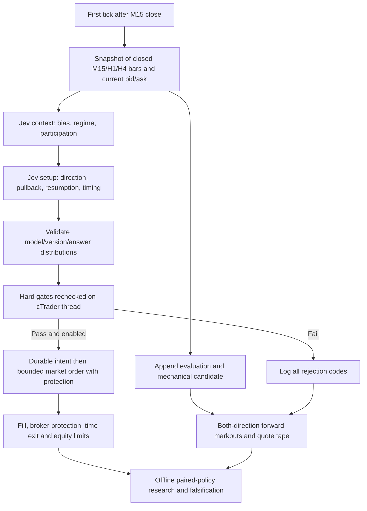

> **BTC update:** The current bot targets BTCUSD with 24/7 eligibility. Read [BTC_SETUP.md](BTC_SETUP.md) first; it supersedes the FX schedule, pip-cost defaults and runtime paths described below.

# Jev + cTrader: V1 research design

## UI design constraint

Eyebrow text is not allowed in the UI design. Do not add eyebrow labels or restore the `.eyebrow` pattern.

## Decision and scope

The hypothesis is **Jev's qualitative veto improves out-of-sample net returns relative to the same mechanically eligible pullbacks, with identical execution and risk**. The primary estimand is paired daily net portfolio P&L difference, not classification consistency, raw win rate, or average P&L per selected trade alone.

V1 uses one liquid FX symbol on one dedicated hedging demo account, one instance on one Windows machine, a fixed UTC session, M15 closed decisions, closed H1/H4 context, a 60-minute time exit, and at least 75 minutes between entries. Stops and targets can exit earlier. The configured 45–90-minute horizon is an intended horizon, never a minimum time to retain a losing position. EURUSD and the numeric defaults are example operational values, not evidence of edge. Choose one symbol/broker/session before collecting the confirmatory sample. No pyramiding, averaging down, trailing stop, discretionary model exits, adaptive sizing, or threshold optimization.

The supplied architecture is the starting architecture; no additional existing repository was supplied. This code is authored source, not a claim of profitability or production certification. V1 intentionally refuses live accounts. After successful research, any live-enable change should be a separately reviewed release. It is not necessary to remove that guard to perform the proposed experiment.

## Architecture

The C# file contains a pure feature/policy core, typed transport models, a TypeSafe HTTP client, a durable journal, and the cTrader adapter. Keeping it in one source file makes cTrader import straightforward; the classes separate responsibilities for unit testing. No external web service, database server, message broker, or chart screenshot pipeline is needed in V1. Python performs offline ingestion and research only. Runtime configuration, prompts, model ID and schema versions are fixed and hashed per experiment.

## Point-in-time construction

1. `OnBarClosed` supplies the just-closed M15 bar. Decision time is its open time plus 15 minutes; observation time is the actual callback time. A bar-close event is tick-driven and can arrive late: late bars are recorded, never traded retroactively. [cTrader bar events](https://help.ctrader.com/ctrader-algo/documentation/cbots/cbot-bar-events/)
2. Select H1/H4 rows only when `open + duration <= decision time`; never assume `LastValue` is closed on another timeframe. Each frame retains 32 raw OHLC/tick-volume rows, 14-bar simple mean true range, 12-bar path efficiency, net movement/ATR and range extrema. These are representations, not a correlated oscillator ensemble.
3. Bar timestamps must be ordered and regular, except bounded Friday-to-Sunday/Monday closures. Unknown holidays/gaps fail closed until the window warms up. This conservative FX-specific rule is not suitable for exchange session calendars without modification.
4. VWAP is explicitly a UTC-day typical-price/tick-count weighted **proxy**. It is null when the midnight anchor is absent. It is not exchange VWAP. Relative tick activity is last-bar tick count divided by the previous 20-bar mean; it has intraday seasonality and is not actual traded volume. Preserve those limitations in the prompt. No synthetic DOM, delta, absorption or liquidity claims: depth and order flow are null in V1.
5. Levels are visible highs/lows in the supplied windows. A structural stop uses the latest four M15 bars plus 0.1 ATR buffer. Opposing level room is computed before entry and rechecked. No pivot requiring future bars is used. Jev receives raw price paths, enough to judge overlap, shape and location without invented swing labels.
6. Calendar JSON is a reviewed point-in-time input, with provider, as-of, coverage and each event's known-at time. Calendar data must cover the entire prospective holding period plus 30 minutes. No entry from 30 minutes before an event's potential overlap with holding through 15 minutes after a high-impact event. In code: reject if any HIGH event falls in `[now-15m, now+hold+30m]`. Empty events are acceptable only with valid provider coverage; missing/stale files are not an empty calendar.

Calendar provider integration is intentionally file-based: an operator or independent licensed feed supplies the exact documented JSON and atomically replaces it. The sample is illustrative and deliberately invalid as a production calendar. No invented provider endpoint or claim of comprehensive news coverage is made. Unscheduled news can still cause a gap.

## Mechanical candidate: deliberately broad

Both H1 and H4 must show net movement in the same direction over their last 12 bars, with efficiency at least 0.25. At least one of the last four M15 candles must oppose that direction, and the latest close must resume relative to the preceding close. This is eligibility, not a full trend-quality definition. Stop distance must be 0.5–2 ATR; entry must be within 2 ATR of the available VWAP proxy; known opposing levels must leave at least a 1.5R target plus 0.1 ATR room. No opposing level in the window means only “none observed,” not unlimited resistance-free space.

The deterministic baseline takes every such candidate that clears the same hard gates. Jev can **veto**, never reverse, resize or loosen a mechanical candidate. This isolates a narrow hypothesis and prevents a model-generated strategy search. Log all structurally valid snapshots, including those with no candidate, so a later preregistered study can assess whether the mechanical universe was too restrictive. That later study is a new experiment, not a rescue of failed V1.

## Exact Jev prompts and integration

`prompts.json` is the exact request question map. Each question is well under 200 words including criteria. Context uses bias, regime and participation. Setup uses direction, pullback integrity, resumption and timing. All questions within a stage see the same state; setup receives the completed context answer map. The model cannot see the deterministic candidate, account P&L, whether execution is enabled, or eventual outcomes.

Jev uses typed questions rather than generated explanation text. Choice answers include an option, its distribution and a distinct confidence statistic. The client uses the documented `/v1/systemone` endpoint and rejects unexpected returned model versions. [TypeSafe quick start](https://docs.typesafe.ai/introduction/quickstart), [Choice contract](https://docs.typesafe.ai/primitives/choice)

Reason codes are literal qualitative answers, e.g. `CONTEXT_regime=BALANCE`, `SETUP_pullback=BROKEN`. They are useful diagnostic tags, **not causal explanations or proof of internal reasoning**. Raw request/response text, timing, distributions and usage are retained. Transport failures record errors; a timeout without a received HTTP body cannot supply one. Do not retry until an answer looks attractive.

Initial trading policy requires TREND; LONG/SHORT bias matching setup and mechanical direction; context bias and regime confidence >=0.60; participation not WEAK; ORDERLY pullback; RESUMING; TIMELY; setup-direction confidence >= configured threshold (minimum 0.60). UNKNOWN participation is allowed because tick-count evidence may be insufficient. Do not gate on every diagnostic confidence: doing so would add arbitrary thresholds and suppress the sample. All confidences remain logged.

The primary “Jev confidence” is the setup-direction Choice confidence. It is not the probability that net P&L is positive, and not necessarily the probability of the selected class. Never multiply stage confidences or apply Kelly sizing to them. [TypeSafe confidence definition](https://docs.typesafe.ai/confidence)

## Execution and risk

| Rule | V1 value / behavior |
|---|---|
| Mode | Observe-only unless both configuration and cBot execution switches are true; demo only |
| Positions | Entire dedicated account must be flat, including pending orders, before entry |
| Frequency | Minimum 75 minutes between successful entries, including across restart; max 4/day |
| Per-trade risk | 0.10% of current equity, constant fraction independent of confidence |
| Daily kill | 0.50% below UTC day's initial observed equity, including floating P&L; latched until next day |
| Global kill | 2% below observed equity high-water mark; persistent manual review latch |
| Decision expiry | 20 seconds from scheduled M15 close; 7-second timeout per stage |
| Quote freshness | Last local tick <=2 seconds; reject invalid bid/ask |
| Spread | <=1.5 pips AND <=0.10 M15 ATR; instrument-specific example values |
| Price drift | <=0.15 ATR from snapshot midpoint |
| Slippage limit | 0.3 pips market-range entry, no retry on failed submission |
| Stop/target | Relative protected order, buffered structural stop, fixed 1.5R target |
| Time exit | 60 minutes from actual entry; session cutoff closes any remaining owned position |
| Fees/reserve | 1 pip sizing reserve example; must replace with measured round-trip fees plus adverse cost buffer |
| Margin | Estimated margin <=50% of free margin; maximum 10,000 units example cap |

Sizing uses `VolumeForFixedRisk`, rounds down to broker steps, caps volume and verifies with `AmountRisked`. Costs are reserved in sizing, not inferred from confidence. These helpers provide estimates, not a guarantee of loss at stop; gaps, changing conversion rates and execution can exceed it. [cTrader Symbol API](https://help.ctrader.com/ctrader-algo/references/MarketData/Symbols/Symbol/)

Entry uses `ExecuteMarketRangeOrder` with stop/target attached. The quote-to-anchor stop distance includes the full permitted entry slippage; the resulting stop can sit slightly farther beyond the anchor depending on actual fill. The risk budget uses that same worst distance. Stops are never tightened or widened by Jev. Protection is checked after the fill; an absent/invalid protection or excessive estimated risk triggers a close and global latch. [cTrader Robot API](https://help.ctrader.com/ctrader-algo/references/General/Robot/)

All mutable cTrader account and trading operations occur on the cBot thread. HTTP work uses immutable snapshot values and is polled by the timer. Model latency cannot block stop/time management. Orders are synchronous but bounded by platform behavior, with one in-flight intent. A durable pending-intent record precedes submission. An ambiguous broker response latches the system rather than resubmitting. The cTrader label plus evaluation ID in the comment links the position to the decision; this is application idempotency, not a broker guarantee of exactly-once execution.

## Lifecycle and failure behavior

- Persistent risk JSON is written to a temporary file, flushed, then replaced. Journal semantic events are flushed durably; quote rows are batched and flushed at least every five seconds and on semantic events. A crash can lose that final quote batch: reconstructed paths must detect/censor gaps.
- A local exclusive file lease prevents concurrent instances sharing the directory. It is not a distributed account lock. V1's dedicated account/single host constraint is mandatory; running another bot with a different directory defeats this assumption.
- Every restart creates `RECONCILE.required`. Existing labeled positions are still supervised using their actual entry time and broker stop. New entries stay blocked until journal, history and pending intent are reconciled manually. Do not delete state to clear a loss limit. Restarts are deliberately not unattended resumptions.
- An API/schema/version failure blocks the evaluation; three consecutive failures latch new entries and close owned positions. A stale response is retained for audit but never executed.
- Disk/audit errors latch the system and attempt risk-reducing closes. Close failures are retried by the timer; the broker stop remains the last line of protection. Timer logs report failed closes. A process or connectivity outage cannot guarantee a time exit; no software-only design can flatten through a disconnected broker.
- `runtime/KILL` triggers a persistent local manual kill and close attempts. Daily/global breaches close owned positions. An orderly bot stop attempts closes; do not use Stop as a guaranteed flatten mechanism without checking the account.
- No trade is placed in a historical cTrader run; otherwise a present-day model/calendar could silently contaminate backtests. Offline replay uses saved decisions. There are no sample credentials and no calls made during delivery.

## What success means

Confidence monotonicity is a separate hypothesis from model selection value. Jev might improve selection without a useful confidence gradient, or produce confident but consistently bad trade selection. V1 is promoted only on after-cost, unseen, paired portfolio evidence. A beautiful rationale, high agreement across repeated calls, or a positive average on a selectively reported subgroup is insufficient. See `VALIDATION.md` for the frozen experiment, falsification rules and outstanding verification.
