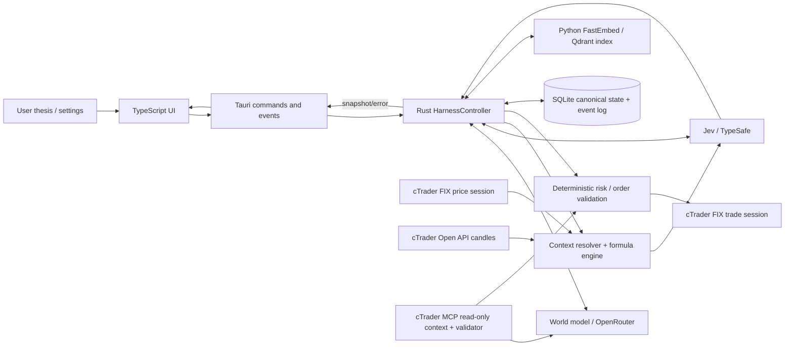

# Espeon Interaction Mismatch and Failure Map

This map follows the current repository implementation and focuses on failures caused by two components disagreeing about identity, schema, state, timing, or outcome. It is a code-path review, not a claim that each listed condition has occurred. A “silent risk” is a path where a failure is swallowed, converted to a default, recorded without a visible UI error, or leaves the loop waiting/retrying without a clear operator signal.

## System boundary map



The primary identity chain for a decision is:

`run_id → loop_id → hypothesis_id → thesis_version_id + context_version_id → live_context_snapshot_id → decision_id → order_id → execution_id → position_id → broker_position_id`.

Any mismatch or lost link in this chain can make a valid action look stale, attach a fill to the wrong state, prevent a close, or make the UI appear unchanged.

## Interaction inventory

| Handoff | Expected agreement | Mismatch/failure modes | Existing handling / silent-failure exposure |
| --- | --- | --- | --- |
| UI → Tauri command | Command name, camelCase payload fields, serialized types, correct desktop context | Stale UI types; wrong argument key; command unavailable in browser preview; serialization/schema drift | `src/services/harness.ts` centralizes calls; errors reject promises, usually shown through UI notices. Browser preview intentionally disables state-changing operations. |
| Tauri app → config/runtime root | Adapter names, credentials, runtime directory, installed-vs-source data root | A different config than expected; source checkout config selected instead of installed data; missing credentials select unavailable adapters | Config parsing rejects unsupported adapter selection. Missing service setup may instantiate `Unavailable*` adapters and later report operation failures. Runtime path selection is in `lib.rs` and `config.rs`. |
| Harness → world model (startup) | Human thesis, run identity, retriever boundary, strict formulation schema | Model emits invalid/missing fields; malformed formula tree; wrong instrument/context source; model asks for unsupported tool | OpenRouter uses structured schemas and validates `liveContextFields`; one bounded repair is attempted for formula validation. Further broker-context request is rejected. Startup errors return from `start_run`; verify UI surfaces them clearly. |
| Harness → world model (review) | Immutable review package refers to the current run/loop/hypothesis/version and cited evidence | Review result arrives after loop/hypothesis changed; MODIFY lacks full mechanism/timeframe; SPLIT lacks escalation, confidence, materially distinct candidate; stale web evidence used as primary | Async completion checks that loop and hypothesis are still current. Invalid lifecycle actions and provider failures are persisted; review checkpoint writes are checked and errors emitted. |
| Harness → Jev (entry) | Hypothesis question, exact context/thesis versions, typed resolved state, allowed choices `LONG/SHORT` (low confidence is represented by confidence, not a Jev1 action) | Prompt asks for incompatible action; malformed Choice payload; unknown choice; confidence/probabilities invalid; Jev sees wrong or stale instrument/context; API returns wrong answer key/type | `typesafe.rs` validates answer count, question ID/type, allowed choice, probabilities, and sum. The first Jev call runs in the supervised cycle after Start; inference and context failures are evented/backoff-managed rather than returned as late startup failures. |
| Harness → Jev (position) | Open canonical position/control, matching loop, current market state, Jev2 choices `HOLD/SELL/BUY MORE` | No current position in model state; position record/control disagreement; wrong direction; stale position identity; Jev2 response schema/action mismatch | TypeSafe rejects Jev2 without a position and validates choices. Harness records inference failure/backoff in continuous cycles. It separately prevents BUY MORE from becoming an order without another Jev1 check. |
| FIX quotes → Rust quote cache | Configured symbol ↔ FIX symbol ID/name; bid/ask tags, sequence numbers, account/environment, session generation | Wrong alias or account; crossed/missing quote; stale quote; sequence gap; reconnect leaves old generation; bid/ask entries associated with wrong repeating group | FIX code validates symbol/session and sequence; snapshot rejects unavailable/stale quotes. Feed health is available in events/status, and failed refreshes are reported as worker failures. |
| cTrader Open API → candle cache | Account, symbol ID, requested period, response correlation ID, candle timestamp/period, completed-bar semantics | Wrong symbol/period/account; stale/missing history; response frame mismatch; candle boundary/timezone mismatch; partial candle treated as complete; FIX quote timeline disagrees with backfill | Request correlation and typed periods are checked. Resolution validates required history and freshness; live-context failure skips Jev and records `live_context_resolution_failed`. Inspect merge precedence and UTC boundary assumptions when debugging a specific timeframe mismatch. |
| FIX + Open API → formula evaluator | `LiveContextSpec.instrument`, formula periods/lookbacks, quote max age, candle provenance | Formula references unavailable period/column; incompatible value types; insufficient history; malformed/non-finite value; quote and candle from different effective windows | Formula requirements/validation and runtime evaluation return errors. Harness records a context-resolution failure and skips the model call; no synthetic `NO TRADE` is created. The UI must make this event easy to see. |
| Hypothesis instrument → risk order → FIX symbol | Instrument string normalization and configured `CTRADER_FIX_SYMBOL_MAP` map to broker-validated symbol | World model uses alternate spelling/suffix; FIX map points at another instrument; entry price came from a different quote instrument; `UNSPECIFIED` fallback; symbol metadata changed | cTrader adapter validates broker symbol mapping before submit. MCP checks account identity; Open API supplies symbol volume limits and the execution validator applies them. A mapping rejection becomes a failed/rejected execution path; ensure it is visible and tied to decision/order IDs. |
| Jev action → risk decision | Action enum, confidence, minimum confidence, available allocation/exposure, position count, duplicate key | `LONG` mapped to SELL side; short/long direction string drift; invalid confidence; wrong allocated fraction; duplicate key differs due to normalized instrument/time; no-trade action paired with order | Rust constructs and records deterministic guardrail result. `order_evaluated` and `guardrail_evaluated` now project the accept/reject status and reason into Activity, so a risk-gate rejection is visible instead of appearing as an unexplained idle loop. Review `risk.rs` and enum/string conversions together; status strings remain loosely typed in several persistence/UI layers. |
| cTrader account equity/currency → deterministic risk sizing | Broker account equity, deposit currency, instrument quote currency, current conversion rate, all open-position notionals | Missing, stale, or wrong-account risk snapshot; quote currency and deposit currency mixed; external positions or working orders omitted; paper capital accidentally applied to a real broker | **Current source behavior (2026-09-29 source review):** `DeterministicRiskEngine` permits static paper capital only when the execution adapter explicitly opts in (`SimulatedBroker`). `CTraderFixBroker` does not opt in and has no `risk_snapshot` override, so a fresh `BrokerRiskSnapshot` is required before the deterministic live risk gate can approve an entry. `McpExecutionValidator` checks account identity and Open API quantity rules; it does not supply the complete equity, free-margin, exposure, or conversion snapshot used by sizing. Espeon still asks the operator to verify those risk values for one cycle. A successful read-only cTrader account lookup was reported on 2026-09-28, but that does not itself provide the missing automatic risk snapshot or prove live execution. |
| Approved order → cTrader FIX trade | Approved order ID, instrument, side, quantity, order kind, stop, broker account, protocol precision | Order lacks approval; wrong kind; broker minimum/increment differs; FIX side/position ID differs; stop format invalid; environment/account mismatch | `validate_order` and MCP volume validation reject mismatches before send. FIX security-list validation checks intended symbol. Broker rejects are converted to receipts; response client-order ID and any returned symbol are checked against the submitted order. The trade session serializes operations and fails on a mismatched report. |
| FIX execution report → canonical execution | Client order ID, status, cumulative fill, average price, broker position ID, `execution_event_id` | Rejection/fill message lacks quantity; status and `ExecType` disagree; partial fill reported as full; average price omitted; broker position ID absent; duplicate or out-of-order report | Non-rejected receipts require positive cumulative fill and average price; market entries also require a broker position ID. Contradictory status/type and mismatched client ID/symbol fail closed, and raw FIX fields are retained. Rejected reports may omit cumulative quantity and then record zero fill. Errors after broker acceptance can still leave broker state ahead of canonical state; reconciliation must block new decisions until a valid snapshot is available. |
| Broker snapshot → local position state → next Jev/order | Snapshot is connected and complete; all positions have valid IDs, symbols, sides and positive quantities; untracked positions have usable entry prices | Reconciliation transport failure; incomplete snapshot; malformed open position; unknown position has no average price; local exposure differs from broker truth | **Current correction:** reconciliation errors/incomplete snapshots are recorded and stop that cycle before Jev/order evaluation. Untracked broker positions with missing/invalid average price are recorded as degraded and also stop the cycle; they are not imported at a fabricated zero price. The next supervised cycle retries reconciliation. |
| Canonical position ↔ broker position | Local `position_id`, broker `broker_position_id`, instrument, side, quantity, average price | Broker position ID missing/reused; local open exists but broker snapshot omits it; partial fill quantity differs; same symbol positions netted/aggregated; side mapping wrong | Reconciliation only mutates from complete snapshots; incomplete/error snapshots are evented. Missing local positions are handled later in reconciliation logic. Verify matching keys and whether broker reports netted positions in the form expected. |
| Harness → SQLite/event log | Same causal event IDs and aggregate IDs across record tables/events; valid FK ordering; transaction atomicity | Record persisted but corresponding event fails; duplicate event ID; wrong aggregate type/ID; partial writes; incompatible event schema | Store methods often wrap record plus event, but some call `append_event` separately. Replay fails on unsupported event kinds or broken references. Inspect transaction boundaries for the exact failing path. |
| SQLite → replay/snapshot → UI | Replay recognizes every canonical event kind and payload schema; API JSON matches TS types | New event kind unrecognized; historical JSON shape differs; UI assumes optional field; replay’s latest state does not match in-memory state | Replay explicitly errors on unsupported event kinds; JSON payload parsing has some defaults (`unwrap_or_default`) that can mask malformed payload content. UI may render missing values as unavailable. |
| Canonical memory → Qdrant bridge | Canonical entity type/ID/event ID and text/provenance align; Python protocol inputs/outputs match Rust | Search index stale; upsert count short; malformed bridge JSON; Python/env/model unavailable; retrieved record points to missing canonical entity | Rust validates canonical references and acknowledgment count. Retrieval is optional/degraded; do not treat Qdrant results as canonical or assume index availability means the matching DB transaction committed. |
| Background worker → UI events | Event name and payload shape; successful snapshot emission after state changes | `emit` fails; snapshot is stale/omitted; worker has error but UI is not listening/re-rendering; run thread exits | Several `app.emit` return values are intentionally ignored (`let _ = app.emit(...)`). Canonical DB may be correct while UI remains stale until next hydration. This is a concrete silent-visibility path. |

## cTrader MCP handshake history and later read-only success

**Historical observation (2026-09-25):** A manual Streamable HTTP sequence previously succeeded after Espeon stopped sending `MCP-Protocol-Version` during `initialize`, then reused the server-negotiated version and session ID for later requests. That establishes that the endpoint worked at that time; it does not establish current availability.

**Direct probe (2026-09-27):** From PowerShell, outside the Espeon adapter, POSTed this JSON-RPC `initialize` request to the cTrader settings URL `http://127.0.0.1:9876/mcp/` with `Content-Type: application/json` and `Accept: application/json, text/event-stream` (no protocol-version header on initialize):

```json
{"jsonrpc":"2.0","id":1,"method":"initialize","params":{"protocolVersion":"2025-11-25","capabilities":{},"clientInfo":{"name":"Espeon-audit","version":"0.1.2"}}}
```

The POST returned HTTP 404, `Server: Microsoft-HTTPAPI/2.0`, `Content-Length: 0`, and an empty body. The same POST still returned 404 without a bearer token and across upper/lower case and trailing-slash path variants. A POST without the required combined `Accept` header returned 406; this confirms content negotiation is checked, but the compliant initialize still fails. Windows HTTP service state shows an active URL registration for `HTTP://127.0.0.1:9876:127.0.0.1/MCP/`, with cTrader process PID 14596 attached to the request queue; Espeon config has MCP enabled, account ID configured, and the matching lowercase URL. `tools/list` could not be reached because initialization did not succeed. No account or trading tool was called.

This shows the failure is reproducible without Espeon's HTTP client, so Espeon's JSON serialization alone does not explain it. The current evidence still does not prove whether the cause is cTrader's MCP route/handler, its active session/configuration, or an undocumented request requirement. The [cTrader setup guide](https://help.ctrader.com/ctrader-ai-agent-connect/local-mcp/setup/) currently documents exactly this URL, and the [MCP Streamable HTTP specification](https://modelcontextprotocol.io/specification/2025-11-25/basic/transports) requires a single endpoint that accepts JSON-RPC POSTs with both JSON and SSE listed in `Accept`. Espeon's source implements the POST-based Streamable HTTP lifecycle (initialize, initialized notification, and tool call) with negotiated version/session handling, but a successful handshake has not been reproduced in the current incident. The direct probe did not prove a live account/tool call. No trading tool or order was called.

On 2026-09-28, the Espeon UI later reported a successful read-only account response from the same cTrader Demo connection. That confirms the account lookup path worked at that time, superseding the earlier failure as evidence of present account-read capability. It does not prove every tool route, current availability, or order execution. The 2026-09-27 direct-probe failure remains useful as incident history, not as the current connection status.

## Confirmed cTrader MCP account-validation false mismatch (2026-09-26)

The live `get_accounts_list` response contained the configured account row, and its broker title, account type, and demo/live state matched the `get_balance` response. The actual failure was `get_balance.accountName = null` while the matched account-list row had `accountName = ""`. Espeon's validator compared JSON serialization (`null` versus `""`) and incorrectly treated these optional display labels as account identity.

The validator now resolves the configured account through `id`, `login`, `accountId`, or `traderId`, does not use `accountName` as an identity check, and compares non-empty broker/type metadata case-insensitively. The probe also distinguishes a reachable MCP server from a subsequent account-validation failure; the UI says “Connection check failed” instead of asserting the server is disconnected for every error. These checks use read-only account metadata; no order or trading tool is involved.

## High-risk mismatch classes

### 1. The broker acted, but Espeon recorded a different result

An order can reach cTrader and receive an execution report whose field combination is not parsed as expected. In `ctrader_fix.rs`, missing `14` (cumulative quantity) and `32` (last quantity) become `0.0`; a report may therefore be considered no-fill even if the broker filled. Conversely, trusting a `filled` status without checking cumulative quantity can also diverge. If the process exits or persistence fails after broker acceptance but before the execution is committed, the next cycle can see a broker position unknown locally. Reconciliation is the recovery boundary, so execution IDs and broker position IDs must be captured and compared.

### 2. A required market observation fails, but the loop only appears idle

The context resolver intentionally skips Jev when required live context fails and appends `live_context_resolution_failed`. This is safer than inventing a no-trade decision, but can look like a no-op if the event stream is not visible or if snapshot delivery fails. Snapshot/error emission failures are logged to stderr; there is no automatic event-delivery retry. Check quote freshness, symbol mapping, candle history, required formula fields, and feed generation together.

### 3. World-model review succeeded, but no lifecycle change occurred

Review results are checked against current loop/hypothesis identity and deterministic action requirements. A result can be valid model JSON yet rejected because it is stale or incomplete. Some rejection is recorded as `autonomous_review_action_rejected` and is expected behavior; other apply errors transition the job to retrying. Confirm the final trigger status and actionAccepted flag instead of inferring success from a completed model call.

### 4. Configuration surfaces disagree

The app has adapter selection in `config/harness.json`, secrets/connector values in `.env` or settings, FIX symbol maps, Open API symbol maps, MCP account/environment IDs, and build-time updater settings. A valid credential paired with the wrong account, environment, symbol alias, or runtime root can fail downstream. Compare effective runtime values (redacting secrets), not just the checked-in examples.

## Concrete silent-failure / visibility review points

The following points were rechecked against current code; earlier versions of this list described already-fixed behavior:

1. **Broker reconciliation now gates the cycle.** Transport errors, incomplete snapshots, and invalid untracked positions are recorded and block Jev/order evaluation. This behavior has a targeted regression test.
2. **Event delivery is logged, not retried.** Canonical writes remain durable, but `emit_snapshot`/`emit_error` only write an emission failure to stderr. The UI may remain stale until a later event or hydration.
3. **Worker-failure persistence can itself fail.** `report_worker_failure` logs a failed canonical write and still attempts the UI error event; if both persistence and event delivery fail, only stderr remains.
4. **FIX reconciliation can only import usable entry basis.** New broker-only positions without a finite positive average price now block synchronization rather than creating a zero-price control. Verify this against broker snapshots if cTrader omits FIX tag 730 for a position.
5. **Filled-price fallback exists in the generic harness.** When an adapter returns a positive fill with `average_price: None`, position control falls back to the approved order's reference price. The cTrader FIX receipt parser rejects a non-rejected execution report without average price, and the simulated broker supplies one, but the generic adapter boundary does not itself reject this combination. Treat this as a remaining adapter-contract gap for any future broker implementation.
6. **Replay rejects unknown event kinds.** A new event kind must be added to the reducer; otherwise replay fails loudly rather than silently omitting it. The previous `market_service_state_changed` replay failure was fixed by adding it to the recognized event cases.

## Incident tracing checklist

For a specific mismatch, follow one concrete event chain and compare IDs/values at each boundary:

1. **Identify the run and loop:** run ID, loop ID, hypothesis ID, active thesis/context version IDs.
2. **Find the last terminal event:** `jev_inference_failed`, `live_context_resolution_failed`, `guardrail_evaluated`, `execution_recorded`, `broker_sync_*`, `autonomous_review_action_rejected`, or `harness:error`.
3. **Check Jev:** request ID, question ID/stage, model, selected action, confidence/probability map, resolved context snapshot ID, and instrument.
4. **Check market data:** configured vs returned symbol, FIX session/account/environment, quote timestamps and generation, requested/returned candle periods, bar completion and gap coverage.
5. **Check risk/order:** decision ID, order ID, side, quantity, price, notional, allocation, guardrail reasons, duplicate key, stop, order kind, approved status.
6. **Check cTrader:** trade account/environment, broker symbol ID/name, FIX ClOrdID, OrdStatus, ExecType, cumulative/last fill quantities, average price, broker order/position IDs, and raw report.
7. **Check persistence/reconciliation:** whether record and causal event both exist; replayed position vs complete broker snapshot; Qdrant index state only after canonical state is confirmed.
8. **Check visibility:** whether `harness:snapshot` or `harness:error` was emitted and received; force workspace hydration to distinguish stale UI from stale runtime state.

## Source map

- `src-tauri/src/lib.rs` — initialization, adapter wiring, background cycle/review worker, Tauri events.
- `src-tauri/src/harness.rs` — orchestration, decision persistence, context resolution, review lifecycle, reconciliation.
- `src-tauri/src/ports.rs` — adapter contracts.
- `src-tauri/src/typesafe.rs` — Jev request/response validation.
- `src-tauri/src/world_model_api.rs` — world-model schemas, formulation/review validation, external research and MCP context.
- `src-tauri/src/market_data.rs` — FIX/Open API market-data acquisition and typed formula resolution.
- `src-tauri/src/ctrader_fix.rs` — FIX quote/trade sessions, symbol checks, execution reports, broker snapshots.
- `src-tauri/src/mcp_context.rs` — cTrader MCP account/environment and volume validation.
- `src-tauri/src/risk.rs` — deterministic guardrails and retry policy.
- `src-tauri/src/storage.rs`, `src-tauri/src/replay.rs` — canonical writes, events, recovery/replay.
- `src/services/harness.ts`, `src/types.ts` — frontend command/event and data-shape boundary.

## FIX position reconciliation correlation and completeness gap (2026-09-27)

Source audit found that `CTraderFixBroker::reconcile` generated a position request ID but never matched responses to it, defaulted a missing report count (tag 727) to one, and then marked whatever was collected as a complete snapshot. This could cause a stale or unrelated FIX position response to mutate canonical positions, or a truncated multi-position response to be treated as the whole account. Missing position identity/symbol/volume fields were also defaulted, both-side quantities silently selected the larger side, and malformed optional entry price was discarded.

The adapter now retains and verifies tag 710 on every Position Report, requires and validates tag 727/728, requires a valid-position identity (721) and symbol (55), checks nonnegative numeric quantities, rejects both-side/zero-volume ambiguity, validates a present settlement price, and only reports complete after exactly the declared number of reports arrives. The documented no-matching-position response must have a zero count and no accumulated positions. These changes are source-only and not yet compiled, exercised against captured FIX frames, or validated against a live snapshot.

The cTrader FIX specification says request 710 is unique and echoed by Position Reports, 727 is required and gives the total report count (zero when the result is not valid), 728 defines valid/no-open-position results, and tags 721/55/704/705/730 provide position identity, symbol, quantities, and average opened price. [Official cTrader FIX specification](https://help.ctrader.com/fix/specification/)

## Lifecycle stop-cap language binding remains under audit (2026-09-27)

Source review of `explicit_user_stop_limits` found stop/max cues were sentence-wide: an earlier cap directive could be inherited by a later unrelated quantity (`Set a maximum of 3 indicators, then review after 4 days`; `Stop after 3 trades and review data after 4 days`). The unitless-limit guard also treated `Stop discussing after 3 indicators` as a stop cap despite the non-trading target. The tokenizer/parser now preserves comma/then/action-clause boundaries and binds cues to the current clause; stop discussion requires a trading/run target or immediate connective fillers. Regression source was added. These parser changes have not yet received a fresh independent review or any execution/build evidence; natural-language support remains an open audit item.

Security-list validation also used flat latest-tag state: a `SymbolName` tag 1007 could inherit a previous tag 55 group. The connector now requires response ID 322 and a valid group count (146), groups repeated 55/1007 fields, verifies cardinality, and matches exactly one configured symbol ID/name pair. This stricter path has not been exercised against the live FIX endpoint; verify a genuine cTrader response shape in the final integration phase.
