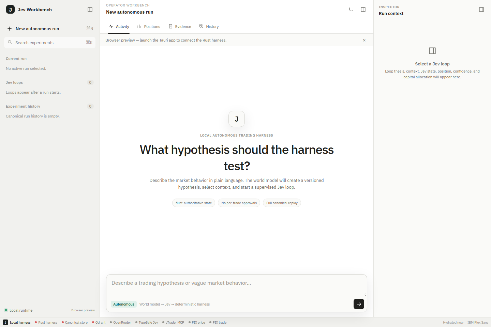

# Phase 10 — Espeon UI

The frontend is now a Codex-style autonomous trading workbench built on the existing Tauri 2 shell. It adapts the resizable sidebar, selectable thread/work-item rows, central activity surface, bottom composer, right contextual inspector, theme system and compact status bar patterns from the MIT-licensed open-source UI credited in `THIRD_PARTY_NOTICES.md`.

## Frontend boundary

All Tauri calls and event subscriptions live in `src/services/harness.ts`:

UI component/rendering → frontend service adapter → Tauri invoke/events → Rust harness.

The frontend displays canonical data. It does not calculate authoritative position, P&L, allocation, risk, model routing or execution state. Missing backend values render as unavailable rather than being estimated.

## Workspace surfaces

- Sidebar: active run, selectable Jev loops, spawned-loop marker, canonical run history and experiment search.
- Work area: structured event stream, positions/execution ledger, evidence/provenance and historical experiments.
- Inspector: selected hypothesis, timeframe, versions, Jev decision/confidence, position, capital allocation, context fields and evidence metadata.
- Composer: starts a new autonomous run from a precise or vague thesis without adding trade approvals.
- Status bar: Rust harness, canonical SQLite store, Qdrant, OpenRouter, TypeSafe Jev, cTrader MCP and both FIX sessions. Rust supplies the non-secret state.

## Recovery and live updates

`hydrate_workspace` restores active runs, historical runs and integration health. `get_run_snapshot` plus `replay_run` hydrate a selected current or historical experiment from canonical state. Background run cycles emit `harness:snapshot`; failures emit `harness:error`. The UI applies these events without moving runtime authority into TypeScript.

Preferences limited to theme, panel visibility and panel width are stored locally. Canonical trading state is never stored as a frontend preference.

## Navigation

- `Ctrl/Cmd + K`: focus experiment search.
- `Ctrl/Cmd + N`: open a new-run composer.
- `Ctrl/Cmd + Enter`: start the composed run.
- `Ctrl/Cmd + B`: toggle the sidebar.
- `Ctrl/Cmd + I`: toggle the inspector.

IBM Plex Sans is packaged locally through `@fontsource/ibm-plex-sans`. Monospace is limited to canonical IDs and raw metadata.
